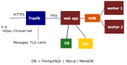

# Ansible Playbook for Papermerge DMS

In this repository are playbooks for production deployment, data backup and
data restoration of Papermerge 3.

Papermerge instance is deployed behind Traefik reverse proxy.
Traefik takes care of TLS certificates.




Choose one of following options:

- option 1: install Papermerge with PostgreSQL database
- option 2: install Papermerge with PostgreSQL + PgBouncer
- option 3: install Papermerge with MariaDB as database


## Requirements

- Remote host with ssh access running Debian12 / Ubuntu 22.04 LTS
- On your local computer you need to have `ansible` == 2.15

## Secrets

This repository does not include "secrets" file.
Secrets file contains all sensitive (paswords, api tokens) info.

You need to create secrets file e.g. in `group_vars` folder
and place following content:


	secret_key: ...
	superuser_password: ...
	database_url: ...
	db_pass: ...
	cloudflare_api_key: ...
	traefik_api_password: ...


## Option 1 / PostgreSQL

Make sure `database_url` in your secrets files matches database related
options in `group_vars/all` (db_user, db_name). Also port number `database_url`
should match the one in `db_postgres/vars/main.yml`.

`database_url` should have following format:

	postgresql://<user>:<pass>@db:5432/<dbname>

Install Papermerge DMS with PostgreSQL:

```
$ ansible-playbook install_1.yml -i inventory --extra-vars "@group_vars/secrets"
```

Application will be accessible via https://<acme_domain>
`acme_domain` is variable you set in `group_vars/all` e.g. trusel.net

## Option 2 / PostgreSQL + PgBouncer

In this setup application will connect to the database via pgbouncer, this
means that `database_url` should point to pgbouncer.

Your `database_url` should look like:

	postgresql://<user>:<pass>@pgbouncer:6432/<dbname>


Install Papermerge DMS with PostgreSQL and PgBouncer:

```
$ ansible-playbook install_2.yml -i inventory --extra-vars "@group_vars/secrets"
```

Application will be accessible via https://<acme_domain>
`acme_domain` is variable you set in `group_vars/all` e.g. trusel.net


## Option 3 / MariaDB

For Mysql/MariaDB `database_url` should have following format:

	mysql://<user>:<pass>@db:3306/<dbname>


Install Papermerge DMS with MariaDB:

```
$ ansible-playbook install_3.yml -i inventory --extra-vars "@group_vars/secrets"
```

## Backup

In order to create a backup:

```
$ ansible-playbook backup.yml
```

## Restore


In order to restore the backup:

```
ansible-playbook restore.yml --extra-vars "backup_file=/backup/backup_20_11_2023-07_33_03.tar.gz"
```

The backup file path is the one from inside docker container.


## Ansible Cheatsheet

```
$ ansible all -m ping
$ ansible all --list-hosts
$ ansible all -m gather_facts
$ ansible all -m apt -a name=vim --become --ask-become-pass
```
